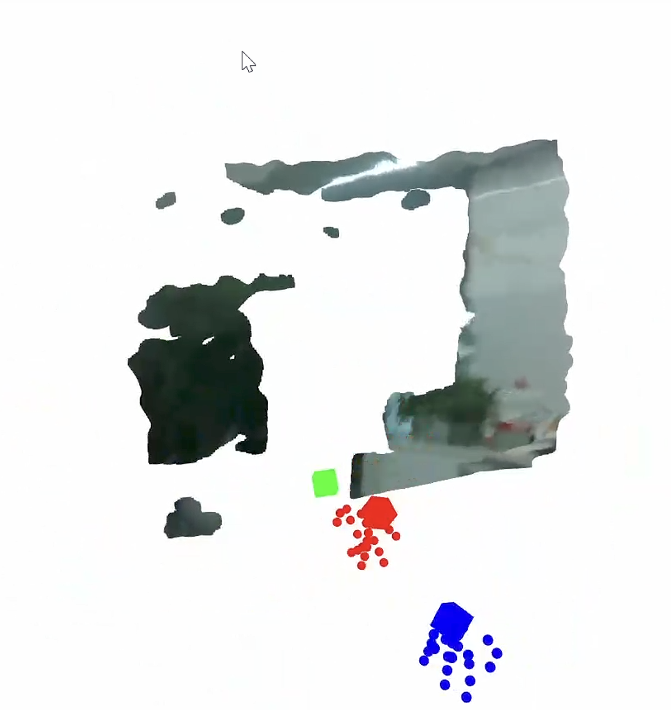

# DEXCAP

> [Setup Tutorial](https://docs.google.com/document/d/1ANxSA_PctkqFf3xqAkyktgBgDWEb)

## 方案
1. **DexCap**
   > 提取：手掌位置, 手掌朝向（yaw）, 手指开合

2. **映射**
   > (x, y, z, yaw)

3. **IK**（SO-101）

4. **控制机器人**

## 难点
1. **工作空间不匹配**
   - 原因：人手范围 > 机器人范围

2. **抖动（非常严重）**
   > 解决：low-pass filter

3. **IK 不稳定**
   > 解决：限制姿态变化/用上一步解作为初值

4. tracker的位置是相对位置/固定世界坐标中的位置

5. 记录时，tracker可能会失去跟踪，可能会缺少相关数据

6. 怎么映射到双so101 机械臂的坐标中
   

## 数据格式
### 原始数据格式
**路径**：`demo1/data/frame_0001/`
```
├── frame_0
│   ├── color_image.jpg      # Chest camera RGB image
│   ├── depth_image.png      # Chest camera depth image
│   ├── pose.txt             # Chest camera 6-DoF pose in world frame
│   ├── pose_2.txt           # Left hand 6-DoF pose in world frame
│   ├── pose_3.txt           # Right hand 6-DoF pose in world frame
│   ├── left_hand_joint.txt  # Left hand joint positions (3D) in the palm frame
│   └── right_hand_joint.txt # Right hand joint positions (3D) in the palm frame
├── frame_1
└── ...
```

### Robomimic 格式（HDF5）

- `obs` - 观测数据
- `actions` - 动作数据
- `dones` - 结束标记

## 环境配置

### 设置 SteamVR 为无头模式

> 参考：https://github.com/username223/SteamVRNoHeadset
> 按照 README 配置好即可

> 视频：https://drive.google.com/file/d/19tjjfK6J3VbHLQXgypuBamkh9hWEK3mJ/view

### Redis Server（老版本，可忽略）

1. Windows 安装 Redis
2. 设置 Redis port 为 6669
3. 测试 Redis
   - 打开 PowerShell（管理员）：
     ```powershell
     dism /online /Enable-Feature /FeatureName:TelnetClient
     ```
   - 执行 telnet：
     ```bash
     telnet 127.0.0.1 6669
     ```
   - ping 返回 `+PONG` → 成功

### Step 1 on NUC

#### 1. 测试接收器连接

```bash
cd Desktop/Dexcap/STEP1_collect_data_202408updates
conda activate dexcap
python vive_test.py
```


#### 2. ROKOKO 连接手套

1. 打开 ROKOKO
2. 连接手套，确保两个手套都连接成功
3. Activate Streaming（流传输）：
   - **IP**: `192.168.0.200`
   - **Port**: `14551`
   - **Data format**: `Json v3`
   > 勾选 **Include connection**


> **Redis（老版本，可忽略）**s
> - 端口：6669
> - 启动：`redis-server`

#### 3. 启动数据采集（NUC）

> 确保连接到专用网络

```bash
conda activate dexcap
cd DexCap/STEP1_collect_data
python redis_glove_server.py
```

> 成功后会显示：
> ```
> Server started, listening on port 14551
> ```
> 并显示手套数据


### Step 2 采集数据
#### 1. 采集数据（无 Tracker）

```bash
cd DexCap/STEP1_collect_data
python data_recording.py -s --store_hand -o ./data_test
```


* 数据格式：
```
data_test/
├── frame_0/
├── frame_1/
├── frame_2/
└── ...
      frame_x/
      ├── color_image.jpg            # RGB 彩色图像
      ├── depth_image.png            # 深度图像： 用于生成3d点云
      ├── left_hand_joint.txt        # 左手 21*3 个关节的 XYZ 坐标
      ├── right_hand_joint.txt       # 右手 21*3 个关节的 XYZ 坐标
      ├── left_hand_joint_ori.txt    # 左手 21*4 个关节的四元数旋转
      └── right_hand_joint_ori.txt   # 右手 21*4 个关节的四元数旋转
```
* 但是缺少：手腕位姿
   > 但也可以转换为 HDF5（训练格式）用于手部抓取训练

* 可视化数据
```bash
python playback_dataset.py -i ./data_test

python playback_dataset.py -i ./data_test --fps 15
```


#### 2. 数据采集（带 Tracker）
```bash
cd DexCap/STEP1_collect_data_202408updates
python vive_realsense_glove_datacollection.py NAME_OF_DEMO
```
* 先进行 tracker 无头模式测试
* `python headless_tracker_test.py`
>
> 测试通过，三个tracker都检测到，并识别到坐标

* 无头模式测试
* `python vive_realsense_glove_datacollection_headless.py demo_test`
> 测试成功，三个tracker都检测到了，open3D显示正常
>  

* 数据结构
```
demo_test/
├── camera_intrinsics.txt      # RealSense相机内参（焦距、主点、畸变系数）
└── data/
    ├── frame_0000/            # 第0帧数据
    ├── frame_0001/            # 第1帧数据
    └── frame_0170/            # 第170帧数据
          └── color.png	      RGB彩色图像
          ├── depth.png	      深度图像
          ├── chest_pose.txt  胸部tracker位姿
          ├── left_pose.txt	左肘tracker位姿
          ├── left_pose.txt	左肘tracker位姿
          ├── raw_left_hand_joint_xyz.txt 21个关节位置	21行×3列
          ├── raw_left_hand_joint_orientation.txt 21个关节旋转	21行×4列 
          ├── raw_right_hand_joint_xyz.txt
          └── raw_right_hand_joint_orientation.txt
```
* 21 数据组成：
   * 0 wrist     （手腕）
   * 1-4	thumb （拇指）
   * 5-8	index （食指）
   * 9-12	middle（中指）
   * 13-16	ring  （无名指）
   * 17-20	pinky （小指）
     * -- mcp, pip, dip, tip

> 1. MCP（Metacarpophalangeal Joint）：拇指与手腕之间的关节。
> 2. PIP（Proximal Interphalangeal Joint）：拇指根部与第一指节之间的关节。
> 3. DIP（Distal Interphalangeal Joint）：拇指第一指节与第二指节之间的关节。
> 4. Tip（指尖）：拇指的最远端，即第二个指节末端。

  * right_elbow
    * -0.566 | -0.354 | -0.168 | 0.940 | -0.025 | 0.339 | 0.009
    * 位置 x,y,z      ｜     旋转四元数 (w,x,y,z)
    * x y z ｜ 可转换为 roll pitch yaw

#### 3. 可视化数据

```bash
python vis_vive_realsense_glove_dataset.py demo_test
```
> 