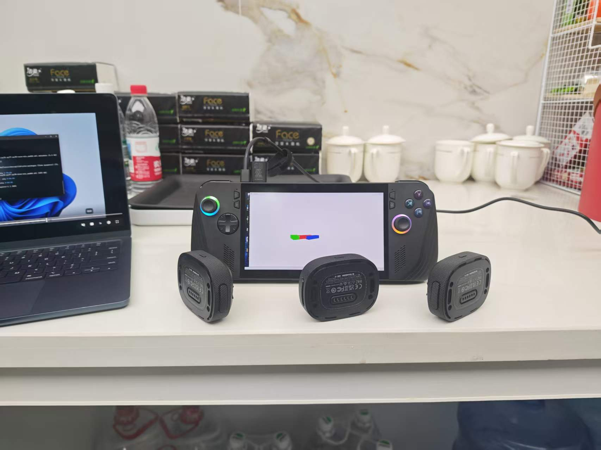
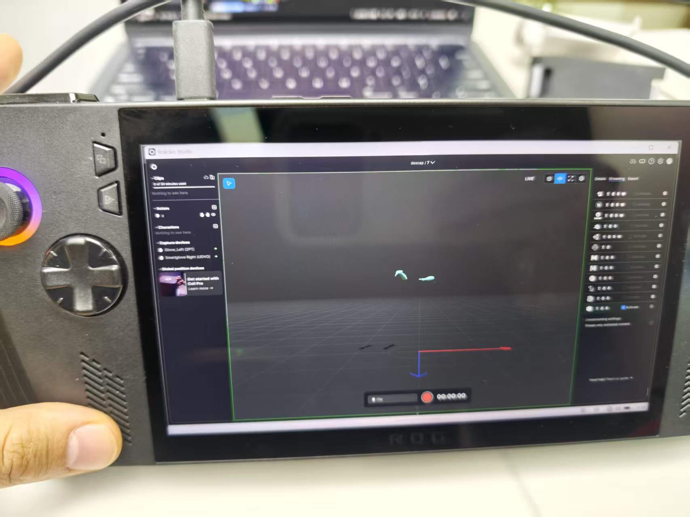
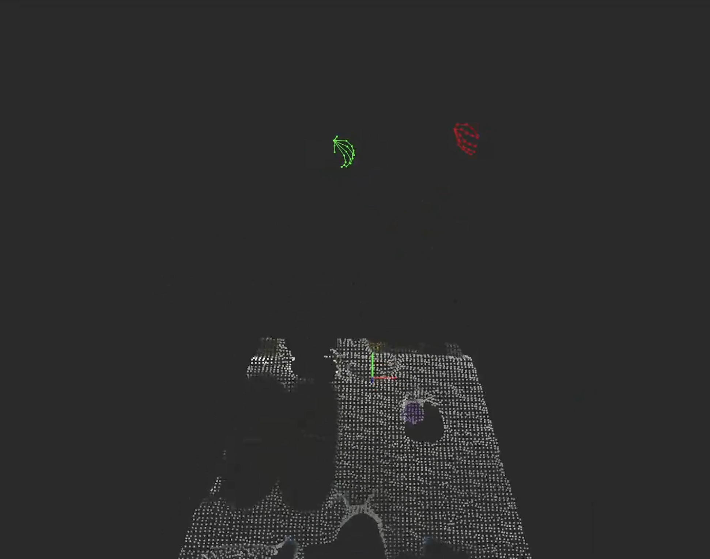
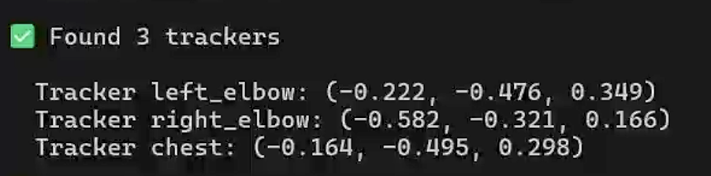
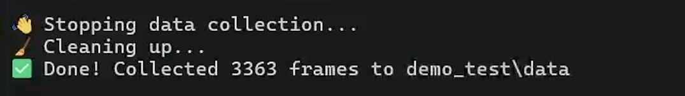
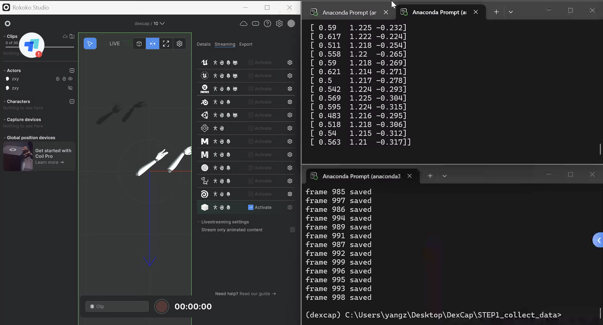
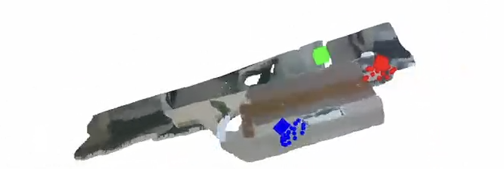
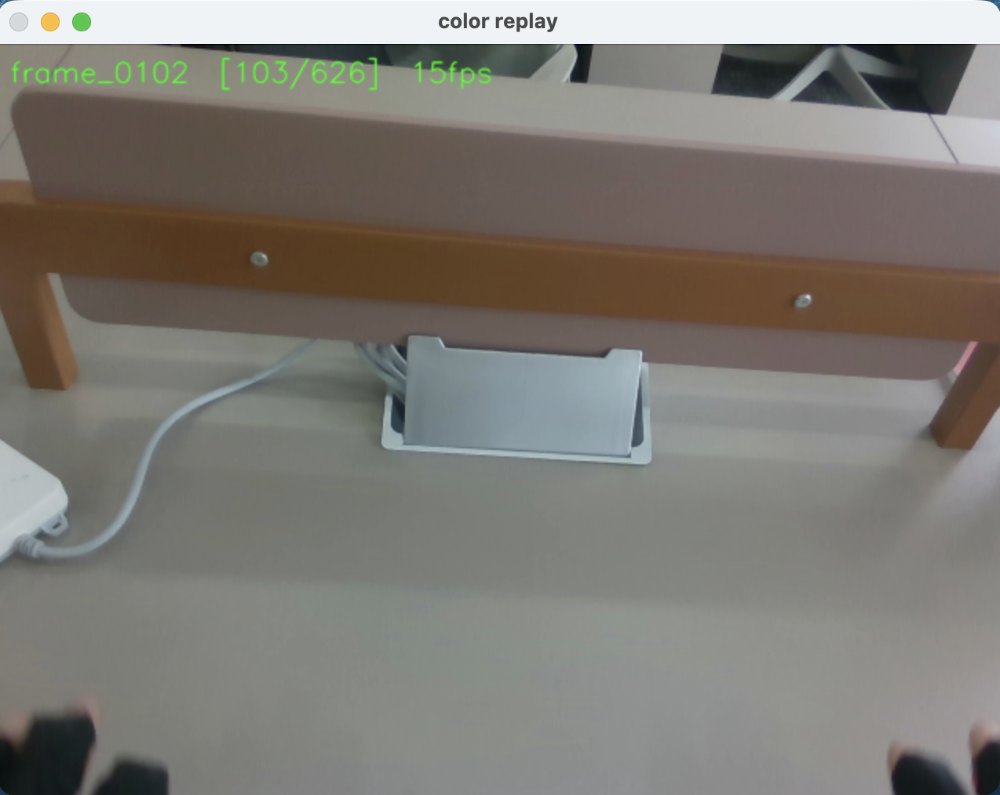

# DEXCAP

> [Setup Tutorial](https://docs.google.com/document/d/1ANxSA_PctkqFf3xqAkyktgBgDWEb)

## 方案

- [x] **DexCap**
   > 提取：手掌位置, 手掌朝向（yaw）, 手指开合

- [x]  **坐标映射**
   > (x, y, z, yaw)

- [x]  **IK**（SO-101）
   * 原流程：人手 21 关节 xyz → PyBullet IK → LEAP Hand 关节角度 → robomimic obs/actions

- [x]  **控制机器人**
- [ ]  **模仿学习（robomimic BC / BC-RNN）**


## 难点

1. **工作空间不匹配**
   - 原因：人手范围 > 机器人范围

2. **抖动（非常严重）**
   > 解决：low-pass filter

3. **IK 不稳定**
   > 解决：限制姿态变化/用上一步解作为初值

4. tracker的位置是相对位置/固定世界坐标中的位置

5. 记录时，tracker可能会失去跟踪，可能会缺少相关数据

6. 怎么映射到双so101 机械臂的坐标中

## 代码组成：
1. STEP1:数据采集
   * `redis_glove_server.py` 接收手套 UDP 数据，推送至 Redis
   * `data_recording_new.py` 数据采集：无trackers数据
   * `playback_dataset.py` 数据回放

2. STEP1 updata：数据采集
   * `vive_test.py` 测试tracker 连接
   * `vive_realsense_glove_datacollection_headless.py` 无头模式数据采集
   * `vis_vive_realsense_glove_dataset.py demo_test` 可视化采集数据

3. STEP2：数据集构建
   * `pybullet_ik_bimanuak.py` PyBullet 双手 IK
   * `demo_create_hdf5.py`生成robomimic格式 HDF5
   * `dataset_utils.py` 读取原始数据，转换为末端位姿
   * `utils.py` 针对偏移的映射
   
4. STEP3：策略训练（`so101_train/`）
   * `build_dataset.py` 把录制数据转为 robomimic HDF5（10D动作）
   * `config_train.yaml` 数据集构建+部署参数
   * `bc_so101.json` robomimic BC-MLP 训练配置
   * `bc_rnn_so101.json` robomimic BC-RNN 训练配置（推荐）
   * `train_so101.py` 训练入口：`python train_so101.py --algo rnn`
   * `env_real_so101.py` 实机推理环境（robomimic EnvBase接口）
   * `run_policy.py` 部署推理：加载checkpoint → 控制真实SO-101

## 数据格式
### 原始数据格式
**路径**：`demo1/data/frame_0001/`

```
├── frame_0
│   ├── color_image.jpg      # Chest camera RGB image
│   ├── depth_image.png      # Chest camera depth image
│   ├── pose.txt             # Chest camera 6-DoF pose in world frame
│   ├── pose_2.txt           # Left hand 6-DoF pose in world frame
│   ├── pose_3.txt           # Right hand 6-DoF pose in world frame
│   ├── left_hand_joint.txt  # Left hand joint positions (3D) in the palm frame
│   └── right_hand_joint.txt # Right hand joint positions (3D) in the palm frame
├── frame_1
└── ...
```

### Robomimic 格式（HDF5）

- `obs` - 观测数据
- `actions` - 动作数据
- `dones` - 结束标记
 
## 1 采集环境配置
### 设置 SteamVR 为无头模式

> 参考：https://github.com/username223/SteamVRNoHeadset
> 按照 README 配置好即可

> 视频：https://drive.google.com/file/d/19tjjfK6J3VbHLQXgypuBamkh9hWEK3mJ/view

### Redis Server（老版本，可忽略）

1. Windows 安装 Redis
2. 设置 Redis port 为 6669
3. 测试 Redis
   - 打开 PowerShell（管理员）：
     ```powershell
     dism /online /Enable-Feature /FeatureName:TelnetClient
     ```
   - 执行 telnet：
     ```bash
     telnet 127.0.0.1 6669
     ```
   - ping 返回 `+PONG` → 成功

### Step 1 on NUC

#### 1. 测试接收器连接

```bash
cd Desktop/Dexcap/STEP1_collect_data_202408updates
conda activate dexcap
python vive_test.py
```


#### 2. ROKOKO 连接手套

1. 打开 ROKOKO
2. 连接手套，确保两个手套都连接成功
3. Activate Streaming（流传输）：
   - **IP**: `192.168.0.200`
   - **Port**: `14551`
   - **Data format**: `Json v3`
   > 勾选 **Include connection**



> **Redis（老版本，可忽略）**
> - 端口：6669
> - 启动：`redis-server`

#### 3. 启动数据采集（NUC）

确保连接到专用网络

```bash
conda activate dexcap
cd DexCap/STEP1_collect_data
python redis_glove_server.py
```

> 成功后会显示：
> ```
> Server started, listening on port 14551
> ```
> 并显示手套数据


## 2 采集数据
### 1. 采集数据（无 Tracker）

```bash
cd DexCap/STEP1_collect_data
python data_recording.py -s --store_hand -o ./data_test
```

* 数据格式：
```
data_test/
├── frame_0/
├── frame_1/
├── frame_2/
└── ...
      frame_x/
      ├── color_image.jpg            # RGB 彩色图像
      ├── depth_image.png            # 深度图像： 用于生成3d点云
      ├── left_hand_joint.txt        # 左手 21*3 个关节的 XYZ 坐标
      ├── right_hand_joint.txt       # 右手 21*3 个关节的 XYZ 坐标
      ├── left_hand_joint_ori.txt    # 左手 21*4 个关节的四元数旋转
      └── right_hand_joint_ori.txt   # 右手 21*4 个关节的四元数旋转
```
* 但是缺少：手腕位姿
   > 但也可以转换为 HDF5（训练格式）用于手部抓取训练

* 可视化数据
```bash
python playback_dataset.py -i ./data_test

python playback_dataset.py -i ./data_test --fps 15
```


### 2. 采集数据（带 Tracker）

* 先进行 tracker 无头模式测试
* `python headless_tracker_test.py`
>
> 测试通过，三个tracker都检测到，并识别到坐标

* 无头模式测试
* `python vive_realsense_glove_datacollection_headless.py demo_test`
> 测试成功，保证三个tracker都检测到了，open3D显示正常
>  

* 采集数据：
```bash
终端1:
conda activate dexcap
cd DexCap/STEP1_collect_data
python redis_glove_server.py

终端2:
conda activate dexcap
cd DexCap/STEP1_collect_data_202408updates
python vive_realsense_glove_datacollection.py NAME_OF_DEMO
```


* 数据结构
```
demo_test/
├── camera_intrinsics.txt      # RealSense相机内参（焦距、主点、畸变系数）
└── data/
    ├── frame_0000/            # 第0帧数据
    ├── frame_0001/            # 第1帧数据
    └── frame_0170/            # 第170帧数据
          └── color.png	      RGB彩色图像
          ├── depth.png	      深度图像
          ├── chest_pose.txt  胸部tracker位姿
          ├── left_pose.txt	左肘tracker位姿
          ├── left_pose.txt	左肘tracker位姿
          ├── raw_left_hand_joint_xyz.txt 21个关节位置	21行×3列
          ├── raw_left_hand_joint_orientation.txt 21个关节旋转	21行×4列 
          ├── raw_right_hand_joint_xyz.txt
          └── raw_right_hand_joint_orientation.txt

  * right_elbow
    * -0.566 | -0.354 | -0.168 | 0.940 | -0.025 | 0.339 | 0.009
    * 位置 (x,y,z)      ｜     旋转四元数 (w,x,y,z)
    * x y z ｜ 可转换为 roll pitch yaw
```

### 3. 可视化数据

```bash
可视化 所有数据：
python vis_vive_realsense_glove_dataset.py demo_test
```
> 
```bash
可视化 2D color.png数据：
conda activate lerobot
cd so101_replay
python replay_color.py 
```
> 

## 在SO—101上复现采集的数据

1. 现在实现方案：相对位移
* tracker位置: tracker[i] - tracker[0]
*  起始位置:	通过 home_eef 手动设置
* 核心公式: robot_pos = home_eef + scale × remap(Δtracker)
  
2. Franka方案：绝对位置
* tracker位置:	直接用 world 坐标中的绝对值
* 起始位置:	通过 absolute_offset 标定
* 核心公式: robot_pos = offset + remap(tracker_world_pos)

方案1: 使用与上一帧的相对位移
---------------------------------------------------------
* 项目结构
   * config.yaml	所有可调参数（scale、URDF路径、fps、滤波等）
   * data_loader.py	加载3364帧 + 缺帧补全 + 低通滤波
   * transform_utils.py	Tracker相对位移 → 机器人末端目标位置
   * so101_ik.py	ikpy封装，热启动IK求解
   * gripper_utils.py	拇指-食指捏合距离 → 夹爪开合度
   * replay_demo_so101.py	主脚本，含 --dry-run 模式

```
环境：
conda activate lerobot
cd DexCap/so101_replay

注意： 要创建两个分开的机械臂校准文件
```
> 采集起始时tracker位置 = 机器人零位
1. 前期准备
   * 读取零位末端坐标
   > `python get_home_eef.py`
   * 可视化tracker数据
   > `visualize_tracker.py --arm left`
   * 校准夹爪
   > `python replay_demo_so101.py --calibrate`

1. Step 2：干跑，观察 IK 输出是否合理
` python replay_demo_so101.py --dry-run`

2. Step 3：慢速实机（config.yaml 改 dry_run: false）
`python replay_demo_so101.py --speed 0.3 `

方案2: 使用与胸前tracker的相对位置
---------------------------------------------------------
 > 左右tracker相对于胸腔tracker的位置 = 机械臂的相对移动
 * `python replay_demo_so101.py --speed 0.8`
 * 优点：不受到人移动的影响
 * 效果较好，能很好反应趋势
  
 方案3: 与tracker进行坐标对齐，直接使用相同坐标
---------------------------------------------------------
* 理论上可以，但实际上没必要，反而更麻烦。
* 麻烦：absolute_offset 标定


模仿学习训练
---------------------------------------------------------
   * 数据转换 `python build_dataset.py`
   * 数据集：`so101_train/dataset.hdf5`（626帧，10D动作）
      > 4_20HDF5--(626 frames, 10D actions, RGB image)
   * 组成：
      * bc_so101.json	robomimic BC-MLP training config (fast baseline)
      * bc_rnn_so101.json	robomimic BC-RNN config (recommended for sequential tasks)
      * train_so101.py	Training entry point — handles absolute path resolution
      * run_policy.py	Deploy trained checkpoint on real SO-101

   * 训练：
      * `cd so101_train && python train_so101.py --algo rnn` # BC-RNN, 600 epochs
      * `python train_so101.py --algo bc `  # BC-MLP, 500 epochs (faster)
      * `python train_so101.py --no-image
      *  ` # low-dim only, for quick sanity check

   * 推理：`python run_policy.py --checkpoint trained_models/.../model_epoch_500.pth`

* 建议：
  * 先录 20–30 demos，用 BC-RNN 跑 600 epochs，看 training loss 能否降到 0.001 以下。如果能，再做实机测试。如果 loss 不降，说明数据不够多或者轨迹质量有问题（抖动太大/不一致）。

* 采集图像为人手，推理时是机械臂
  * 先跑 --no-image 验证动作轨迹正确，之后再加图像。如果加了图像效果变差，说明域偏移是主要瓶颈，再考虑上面的方法。

* Dexcap 做法
  * 第一步：把图像里的人手遮掉（mask_image）
  * 第二步：主要用点云，不用图像
  * 第三步：点云里的人手换成 LEAP Hand 网格

Lerobot
-------------------------------------------------------------
1. 数据转换为lerobot 格式
* `cd so101_lerobot`
* 首次生成 `python build_lerobot_dataset.py`
* 重新生成（覆盖已有数据集）`python build_lerobot_dataset.py --force`

2. 训练
* ACT（推荐，适合双臂长序列）
> python train_lerobot.py --policy act --steps 20000 --batch 8 --device cuda

> ACT 参数 --chunk-size 32：一次预测 32 帧动作，小数据建议用 32 而非默认 100

* Diffusion（精细操作好，但慢）
> python train_lerobot.py --policy diffusion --steps 50000 --batch 16 --device cuda

> Diffusion 参数 --horizon 16 --n-action-steps 8：预测 16 步动作，执行前 8 步. 推理慢（100 步 denoising），必须 GPU

3. 推理
* 干跑
   ```
   python eval_lerobot.py \
      --checkpoint outputs/act_so101/checkpoints/last/pretrained_model \
      --dry-run --horizon 5
   ```
* 实机部署
   ```
   python eval_lerobot.py \
      --checkpoint outputs/act_so101/checkpoints/last/pretrained_model \
      --horizon 400 --episodes 3
   ```